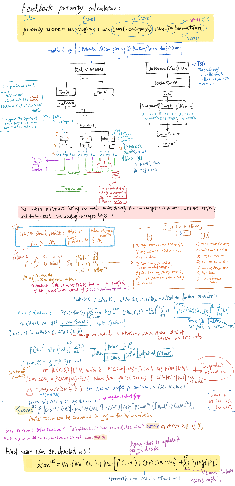

# Bayesian-Framework-Based-Feedback-Scorer-and-Prioritizer

**Bayesian Framework Based Feedback Scorer and Prioritizer(BFSP)** is designed for small companies relying heavily on feedback as a key reference, scoring and prioritizing each piece of feedback by mapping it to 3 main categories and 15 subcategories via LLM, while factoring in sentiment, information entropy, and category-based costs. **In short, the model ranks feedback by priority, replacing tedious manual sorting. (e.g., Top-scoring feedback tends to involve low-cost changes, such as UI tweaks, or rich in information.)** 

This means that employees no longer need to read through each feedback item individually or spend excessive time debating which feedback provides the most valuable input for product updates:) Instead, team members can prioritize their work by focusing on the highest-scoring feedback first.

The reason for choosing a Bayesian framework is its competence in dynamic updates with small datasets, while taking prior knowledge into consideration for context-based startups. BFSP simplifies traditional classifiers by leveraging LLMs' intelligence regarding conditional probability, optimizing the capacity of LLMs on capturing the correlation between main and sub categories, which is relatively hard to capture in the traditional context. Parameters and priors need to be tuned based on your feedback trends, using expectation calculations instead of sampling for efficiency.

# Flow Chart

# Discussion & Future Directions

As this model is focusing solely on feedback analysis, it’s based on 3 prerequisites：
- LLMs can provide informative insights into aspects that differ from human interpretations :) For example, feedback like “I feel tired looking at this page” may be interpreted by humans as a lack of visual elements, while LLMs might consider whether it’s due to heavy content, formatting issues, etc.
- LLMs can only be partially aware of feedback tendencies within a specific context, which can be roughly addressed by incorporating prior knowledge provided by humans, while breaking down the analysis stages during the LLM’s processing to track possible bias (or, in other words, to limit uncertainty).
- LLMs are aware of the relationship between main categories C and subcategories S (e.g., if a piece of feedback is strongly related to C1, the LLM may respond by assigning a higher probability to S1). However, this is just an assumption :) Thus, a hierarchical model is still needed to quantify and evaluate the LLM’s competence.
which may need to be confirmed via more rigorous approaches (But for small companies, who cares:) not my job)

In addition:
- We may still need to test optimized structures of the final model via the criterion of DIC. For example, the amount of information could be combined and multiplied into score 2.

(which may need to be confirmed via more rigorous approaches. But for small companies, it's enough for a quick estimate.)

**I actually considered removing the prior for C1 if the hypothesis of “As LLMs are machines mimicking human beings, it should have preferences on UI/UX/Others” is true. Say, if we’re inclined to raise UX-related feedback, LLMs should incline to categorize feedback into UX :) However, who knows. Thus, the estimation process is still divided into stages.**

## References
1. Cheng, FM., Wang, J., Chen, C. et al. Product design improvement method driven by online product reviews. *Sci Rep* 15, 10252 (2025). https://doi.org/10.1038/s41598-025-94422-2 
2. Pour, A. F., & Dalton, L. A. (2019). Theory of Optimal Bayesian Feature Filtering. *ArXiv.* https://arxiv.org/abs/1909.03637
3. He, D., Li, L., Zhang, H., Liu, F., Li, S., Xiu, X., Fan, C., Qi, M., Meng, M., Ye, J., Mort, M., Stenson, P. D., Cooper, D. N., & Zhao, H. (2024). Accurate identification of genes associated with brain disorders by integrating heterogeneous genomic data into a Bayesian framework. *EBioMedicine, 107,* 105286. https://doi.org/10.1016/j.ebiom.2024.105286

